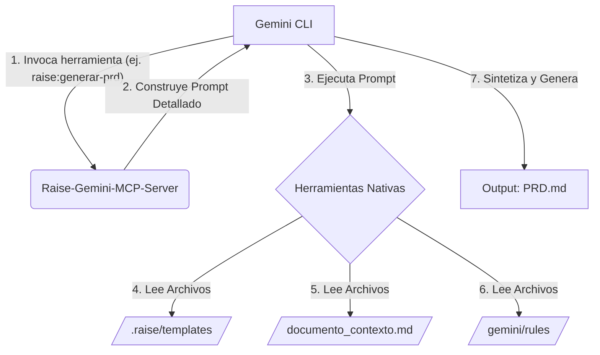

# Documento de Requisitos del Proyecto (PRD): Servidor MCP para Gemini CLI

**Versión:** 1.0
**Fecha:** 2025-08-01

## 1. Resumen Ejecutivo

### 1.1. Problema
La generación y actualización de la documentación técnica bajo la metodología RaiSE es un proceso manual, propenso a errores y consume mucho tiempo. Los desarrolladores necesitan una forma de automatizar la creación de artefactos de documentación (como PRDs, HUs, etc.) directamente desde su entorno de desarrollo, asegurando consistencia y cumplimiento con las plantillas y reglas del proyecto.

### 1.2. Solución Propuesta
Se propone el desarrollo de un **Servidor de Protocolo de Contexto de Modelo (MCP)** en Python, llamado `Raise-Gemini-MCP-Server`. Este servidor se integrará con la herramienta Gemini CLI y expondrá un conjunto de herramientas (`tools`) para automatizar la generación de documentos RaiSE. El servidor utilizará plantillas predefinidas y un conjunto de reglas para asegurar que los documentos generados sean consistentes, completos y sigan los estándares de la metodología RaiSE.

### 1.3. Alcance
El alcance de este proyecto se centra en:
*   **Creación de un servidor MCP básico** utilizando el framework FastMCP.
*   **Implementación de una herramienta inicial `raise:generar-prd`** que, a partir de un contexto proporcionado, genere un PRD completo.
*   **Diseño de un sistema de prompts reutilizable** que permita añadir fácilmente nuevas herramientas para otros tipos de documentos en el futuro.
*   **Asegurar la conectividad** entre el servidor MCP y Gemini CLI a través de Server-Sent Events (SSE).

## 2. Objetivos del Proyecto

### 2.1. Objetivos de Negocio
*   **Reducir el tiempo** dedicado a la creación de documentación en un 50%.
*   **Aumentar la consistencia y calidad** de la documentación del proyecto.
*   **Mejorar la productividad** del desarrollador al integrar la documentación en su flujo de trabajo.

### 2.2. Objetivos Técnicos
*   Implementar un servidor MCP en Python capaz de comunicarse con Gemini CLI.
*   Crear una arquitectura de herramientas MCP modular y escalable.
*   Automatizar la lectura de plantillas y la escritura de documentos generados.

## 3. Requisitos Funcionales

| ID | Requisito | Prioridad |
| :--- | :--- | :--- |
| RF-001 | El servidor MCP debe exponer una herramienta `raise:generar-prd`. | Alta |
| RF-002 | La herramienta `raise:generar-prd` debe aceptar una lista de rutas de archivos como contexto. | Alta |
| RF-003 | La herramienta debe leer una plantilla de PRD (`.raise/templates/solution/project_requirements.md`). | Alta |
| RF-004 | La herramienta debe leer un conjunto de reglas de documentación (`.gemini/rules/*.mdc`). | Media |
| RF-005 | La herramienta debe generar un prompt que instruya a Gemini CLI para sintetizar el PRD. | Alta |
| RF-006 | El servidor debe ser capaz de manejar múltiples herramientas en el futuro (ej. `generar-hu`). | Media |

## 4. Requisitos No Funcionales

| ID | Requisito | Criterio de Aceptación |
| :--- | :--- | :--- |
| RNF-001 | **Rendimiento** | El servidor debe responder a las solicitudes de Gemini CLI en menos de 500ms. |
| RNF-002 | **Escalabilidad** | La arquitectura debe permitir añadir nuevas herramientas sin modificar el núcleo del servidor. |
| RNF-003 | **Mantenibilidad** | El código debe estar modularizado (ej. `mcp_server.py`, `prompt_utils.py`) y bien documentado. |
| RNF-004 | **Seguridad** | La comunicación entre el CLI y el servidor será local, pero no se deben exponer datos sensibles. |

## 5. Diseño de la Arquitectura

Se utilizará una arquitectura de microservicios desacoplada, donde el `Raise-Gemini-MCP-Server` actúa como un servicio especializado en la generación de prompts para la automatización de documentos.

## 6. Plan de Implementación (Roadmap)

| Fase | Hito | Estimación |
| :--- | :--- | :--- |
| 1 | **Configuración del Entorno** | 2 horas |
| 2 | **Creación del Servidor MCP Básico** | 4 horas |
| 3 | **Implementación de `prompt_utils`** | 3 horas |
| 4 | **Implementación de la herramienta `raise:generar-prd`** | 5 horas |
| 5 | **Pruebas de Integración y Depuración** | 4 horas |

## 7. Riesgos y Mitigaciones

| Riesgo | Probabilidad | Impacto | Mitigación |
| :--- | :--- | :--- | :--- |
| Cambios en la API de Gemini CLI | Baja | Alto | Mantenerse actualizado con la documentación oficial y tener un conjunto de pruebas de regresión. |
| Complejidad en la generación de prompts | Media | Medio | Empezar con prompts simples y añadir complejidad de forma iterativa. |
