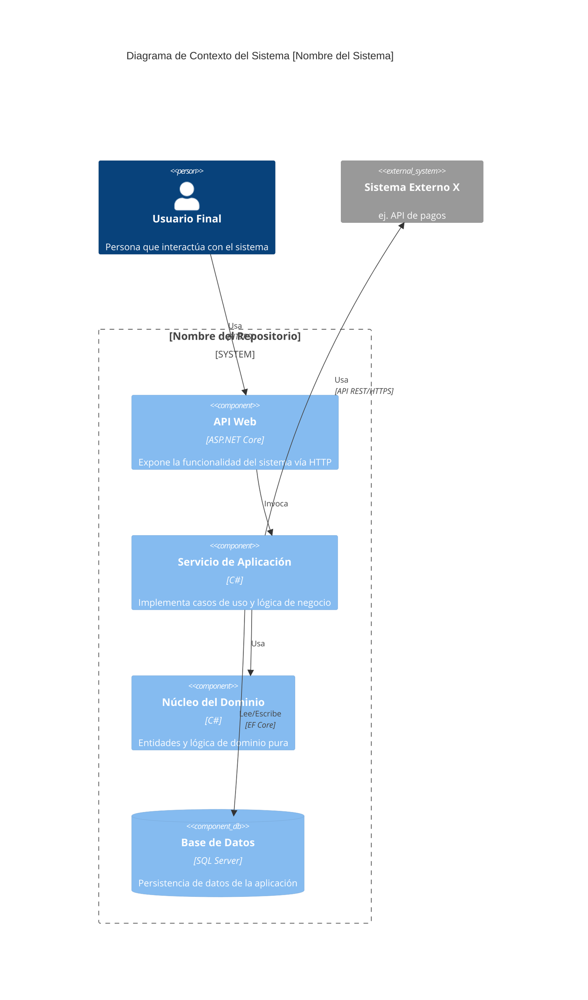

# Descripción General de la Arquitectura: [Nombre del Repositorio]

**ID Documento:** `[SAR-ARCOVW]-[CODIGOPROYECTO]-[SEQ]`
**Documento Padre:** `[resumen_repositorio.md#ID]`
**Versión:** `1.0`
**Fecha:** `[AAAA-MM-DD]`

## 1. Descripción y Propósito del Sistema

*[Retomar del PRD o documentación existente si es posible, o inferir del código. ¿Qué hace el sistema? ¿Qué problema de negocio resuelve?]*

## 2. Estilo Arquitectónico Identificado

*   **Estilo Arquitectónico Principal:** `[ej., Arquitectura Limpia (Onion), N-Capas Tradicional, Microservicios, Monolito Modular, Orientado a Eventos, etc.]`
*   **Justificación:**
    *   `[Evidencia observada en la estructura de proyectos, flujos de dependencia, patrones de comunicación que soportan esta identificación.]`
    *   `[ej., Presencia de proyectos Core/Domain, Application, Infrastructure y Presentation/WebAPI sugiere Arquitectura Limpia.]`
    *   `[ej., Un único proyecto grande con namespaces para UI, Lógica y Datos podría ser un Monolito N-Capas.]`
*   **Variaciones o Estilos Secundarios (si aplica):**
    *   `[ej., Aunque predominantemente monolítico, usa un bus de eventos para ciertos módulos desacoplados.]`

## 3. Capas Arquitectónicas Identificadas

*[Describir las capas lógicas principales de la aplicación. Para cada capa, indicar su responsabilidad principal y los proyectos/namespaces que la componen.]*

*   **Capa 1: [Nombre de la Capa, ej., Dominio/Core]**
    *   **Responsabilidad Principal:** `[ej., Contiene las entidades de negocio, lógica de dominio central, interfaces de repositorio. Debe ser independiente de tecnología.]`
    *   **Proyectos/Namespaces Mapeados:**
        *   `[ProyectoA.Core.Entities]`
        *   `[ProyectoA.Domain]`
*   **Capa 2: [Nombre de la Capa, ej., Aplicación/Casos de Uso]**
    *   **Responsabilidad Principal:** `[ej., Orquesta los casos de uso, implementa la lógica de aplicación, depende de abstracciones del dominio y coordina con la infraestructura.]`
    *   **Proyectos/Namespaces Mapeados:**
        *   `[ProyectoA.Application.Services]`
        *   `[ProyectoA.Application.UseCases]`
*   **Capa 3: [Nombre de la Capa, ej., Infraestructura]**
    *   **Responsabilidad Principal:** `[ej., Implementa acceso a datos (repositorios), comunicación con servicios externos, logging, etc. Depende de la capa de Aplicación o Dominio (vía inversión de dependencias).]`
    *   **Proyectos/Namespaces Mapeados:**
        *   `[ProyectoA.Infrastructure.Data]`
        *   `[ProyectoA.Infrastructure.ExternalServices]`
*   **Capa 4: [Nombre de la Capa, ej., Presentación/Frameworks & Drivers]**
    *   **Responsabilidad Principal:** `[ej., Expone la API (ASP.NET Core Web API), maneja la UI (MVC, Razor Pages), o actúa como punto de entrada (Worker Service, Consola).]`
    *   **Proyectos/Namespaces Mapeados:**
        *   `[ProyectoA.WebAPI]`
        *   `[ProyectoA.UI]`
*   **(Otras capas si son evidentes, ej., Capa de Pruebas, Capa Común/Compartida)**

## 4. Componentes/Módulos Centrales y sus Interacciones

*[Identificar los componentes o módulos funcionales más significativos del sistema. Un componente puede ser un proyecto, un conjunto de namespaces relacionados, o una agrupación lógica de funcionalidades.]*

*   **Componente 1: [Nombre del Componente, ej., Gestión de Pedidos]**
    *   **Descripción Breve:** `[Responsable de crear, actualizar y consultar pedidos.]`
    *   **Proyectos/Namespaces Clave:** `[ProyectoA.Application.Orders, ProyectoA.Domain.Order]`
    *   **Interacciones Principales:**
        *   `[ej., Recibe solicitudes de la API de Pedidos (Presentación).]`
        *   `[ej., Utiliza el Repositorio de Pedidos (Infraestructura) para persistencia.]`
        *   `[ej., Publica eventos de Pedido Creado (potencialmente a un bus de eventos).]`
*   **Componente 2: [Nombre del Componente, ej., Módulo de Autenticación y Autorización]**
    *   **Descripción Breve:** `[Maneja la verificación de credenciales y la gestión de permisos.]`
    *   **Proyectos/Namespaces Clave:** `[ProyectoA.Infrastructure.Identity, Middleware en ProyectoA.WebAPI]`
    *   **Interacciones Principales:**
        *   `[ej., Utilizado por la mayoría de los endpoints de la API.]`
        *   `[ej., Interactúa con un proveedor de identidad externo o una base de datos de usuarios.]`
*   *(Listar otros componentes clave)*

*(Opcional: Incluir un diagrama de componentes de alto nivel, ej., usando Mermaid)*

## 5. Flujo de Datos Conceptual (Ejemplos Clave)

*[Describir cómo fluyen los datos a través del sistema para uno o dos escenarios de usuario importantes. No necesita ser exhaustivo, sino ilustrativo.]*

*   **Escenario: [ej., Creación de un Nuevo Usuario]**
    1.  `[Usuario envía datos de registro a endpoint POST /api/users (Presentación - WebAPI).]`
    2.  `[El controlador de la API invoca un Comando/Servicio en la capa de Aplicación (ej., CreateUserCommand).]`
    3.  `[El manejador del comando valida los datos y crea una nueva entidad User (Dominio).]`
    4.  `[El manejador del comando utiliza IUserRepository (abstracción en Dominio/Aplicación) para persistir la entidad User.]`
    5.  `[La implementación de IUserRepository (Infraestructura) guarda el usuario en la base de datos.]`
    6.  `[Se retorna una respuesta HTTP 201 Created al usuario.]`

## 6. Consideraciones Transversales Clave

*[Describir brevemente cómo se manejan las preocupaciones comunes que afectan a múltiples partes del sistema.]*

*   **Configuración:** `[ej., Uso de appsettings.json, variables de entorno, Azure App Configuration. Cómo se accede en diferentes capas.]`
*   **Logging:** `[ej., Uso de ILogger<T>, Serilog, NLog. Dónde se configura, cómo se inyecta, qué tipo de información se registra.]`
*   **Autenticación y Autorización:** `[ej., JWT Bearer Tokens, IdentityServer, ASP.NET Core Identity. Cómo se aplican los atributos [Authorize].]`
*   **Manejo de Excepciones:** `[ej., Middleware de manejo de excepciones global, try-catch específicos, tipos de excepciones personalizadas.]`
*   **Inyección de Dependencias (DI):** `[ej., Contenedor de DI de ASP.NET Core. Registro de servicios (Scoped, Transient, Singleton). Dónde se configuran las dependencias.]`

## 7. Historial del Documento

| Versión | Fecha      | Autor(es)      | Cambios Realizados                                             |
|---------|------------|----------------|----------------------------------------------------------------|
| 1.0     | AAAA-MM-DD | [Nombre(s)]    | Versión inicial de la descripción general de la arquitectura. |
| ...     | ...        | ...            | ...                                                            |
