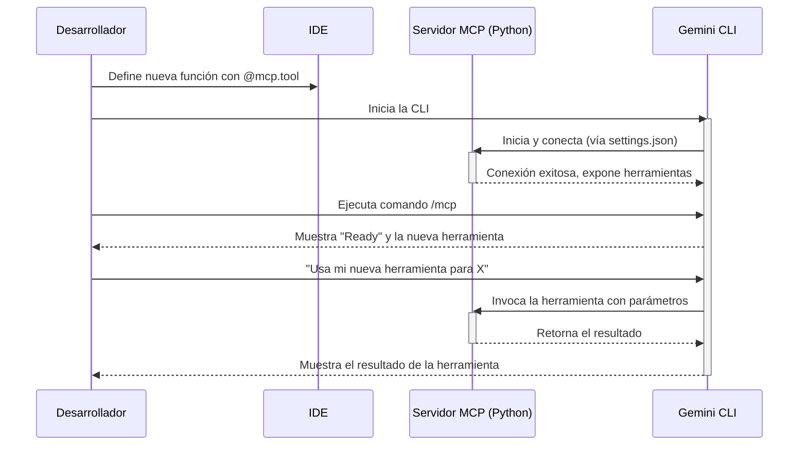

# Documento de Requisitos del Proyecto (PRD): Servidor MCP de Python para Gemini CLI

## 1. Introducción y Metas del Proyecto

### 1.1. Resumen del Proyecto
Este proyecto consiste en el diseño, desarrollo y documentación de un servidor basado en Python que implementa el Protocolo de Contexto del Modelo (MCP). Este servidor actuará como un puente para extender las capacidades de la Interfaz de Línea de Comandos (CLI) de Gemini, permitiéndole interactuar con herramientas locales personalizadas. El objetivo es crear un sistema robusto y fácil de usar que permita a los desarrolladores automatizar y mejorar sus flujos de trabajo mediante la integración de sus propios scripts y lógica de negocio con el agente de IA de Gemini.

### 1.2. Problema de Negocio / Oportunidad
Actualmente, la Gemini CLI viene con un conjunto de herramientas integradas que, si bien son potentes, no cubren las necesidades específicas de todos los flujos de trabajo de desarrollo. Los desarrolladores necesitan una forma estandarizada y eficiente de ampliar las capacidades del agente de IA para que pueda interactuar con sistemas de archivos locales, bases de datos, APIs internas y otra lógica de negocio personalizada. La falta de un mecanismo de extensión claro y bien documentado conduce a soluciones ad-hoc, aumenta la complejidad de la integración y limita el potencial de automatización de la IA en tareas de desarrollo del día a día. Este proyecto busca resolver ese problema proporcionando una solución basada en el estándar abierto MCP.

### 1.3. Metas y Objetivos del Proyecto
*   **Meta 1:** Facilitar la extensibilidad de la Gemini CLI con herramientas personalizadas.
    *   *Objetivo Específico:* Desarrollar un servidor MCP en Python utilizando el framework FastMCP que sirva como plantilla y punto de partida.
*   **Meta 2:** Reducir la complejidad de la configuración y la integración.
    *   *Objetivo Específico:* Proporcionar una guía de implementación detallada y ejemplos de código claros que cubran desde la configuración del entorno hasta la depuración de problemas comunes.
*   **Meta 3:** Mejorar la productividad del desarrollador a través de la automatización.
    *   *Objetivo Específico:* Implementar un conjunto inicial de herramientas personalizadas útiles (p. ej., lectura/escritura de archivos, ejecución de comandos específicos del proyecto) que demuestren el valor del servidor MCP.

### 1.4. Métricas de Éxito
*   **Métrica 1:** Tiempo de configuración del entorno.
    *   **Objetivo:** Un desarrollador debe ser capaz de configurar el entorno completo (CLI + Servidor MCP) y tener una herramienta de ejemplo funcionando en menos de 30 minutos siguiendo la guía.
    *   **Método de Medición:** Pruebas de usabilidad con miembros del equipo de desarrollo.
*   **Métrica 2:** Tasa de adopción de herramientas personalizadas.
    *   **Objetivo:** Al menos el 80% de los desarrolladores del equipo utilizan al menos una herramienta MCP personalizada en su flujo de trabajo diario dentro de los 2 meses posteriores al lanzamiento.
    *   **Método de Medición:** Encuestas y análisis de logs de uso del servidor.
*   **Métrica 3:** Reducción de errores de configuración.
    *   **Objetivo:** Disminuir en un 90% las preguntas y errores relacionados con la conexión entre la CLI y el servidor local, gracias a la claridad de la documentación y las guías de solución de problemas.
    *   **Método de Medición:** Seguimiento de incidencias y preguntas en los canales de soporte del equipo.

## 2. Stakeholders y Usuarios

### 2.1. Stakeholders Clave
| Rol/Nombre | Responsabilidad/Interés Principal |
|---|---|
| Líder Técnico | Asegurar la calidad técnica, la mantenibilidad y la alineación con la arquitectura general. |
| Equipo de Desarrollo | Utilizar la solución para mejorar la productividad y automatizar tareas. |
| Product Owner | Definir las funcionalidades clave y priorizar el backlog para maximizar el valor de negocio. |

### 2.2. Usuarios Objetivo / Personas
*   **Usuario Tipo 1: Desarrollador Python**
    *   *Descripción:* Un desarrollador con experiencia en Python que utiliza la Gemini CLI para tareas de generación de código, análisis y refactorización.
    *   *Necesidades Clave:* Extender la CLI para que pueda interactuar con sus scripts de Python locales, bases de datos y APIs internas.
    *   *Puntos de Dolor Actuales:* Proceso manual para pasar datos entre la CLI y sus herramientas locales; falta de un puente de comunicación directo.
    *   *Beneficios Esperados:* Capacidad de invocar sus propias herramientas directamente desde el prompt de Gemini, creando un flujo de trabajo de desarrollo asistido por IA más fluido y potente.

## 3. Alcance del Proyecto

### 3.1. Dentro del Alcance (Funcionalidades Clave)
*   **Configuración del Entorno:** Guía detallada para instalar y configurar Node.js, Python, Gemini CLI y las dependencias necesarias.
*   **Autenticación:** Documentación clara sobre los métodos de autenticación (OAuth 2.0 vs. API Key), con una fuerte recomendación de usar OAuth para acceder al nivel gratuito.
*   **Desarrollo del Servidor MCP:** Implementación de un servidor MCP base en Python usando el framework FastMCP.
*   **Definición de Herramientas:** Creación de al menos dos herramientas de ejemplo (ej: una para operaciones matemáticas simples y otra para interactuar con el sistema de archivos).
*   **Integración con Gemini CLI:** Configuración del archivo `settings.json` para conectar la CLI con el servidor MCP local a través del transporte `stdio`.
*   **Verificación y Depuración:** Documentación de los comandos (`/mcp`, `/tools`) y procedimientos para verificar la conexión y diagnosticar problemas comunes.

### 3.2. Fuera del Alcance
*   Desarrollo de una interfaz gráfica de usuario (GUI) para la gestión del servidor.
*   Soporte para otros lenguajes de programación para el servidor MCP (el foco es exclusivamente Python).
*   Integración con servidores MCP remotos a través de HTTP/SSE en la versión inicial.
*   Implementación de mecanismos de autenticación complejos para las herramientas personalizadas.

### 3.3. Consideraciones Futuras (Posibles Fases Posteriores)
*   Añadir soporte para el transporte SSE para permitir conexiones de red.
*   Crear una biblioteca de herramientas MCP pre-construidas para tareas comunes (ej: interacción con Git, Docker, etc.).
*   Desarrollar un generador de código que cree la estructura básica de un nuevo servidor MCP y sus herramientas.

## 4. Requisitos Funcionales

### 4.1. Resumen de Capacidades
*   **Capacidad: Configuración del Servidor**
    *   Requisito 1.1: El sistema debe permitir instanciar un servidor MCP con un nombre único.
    *   Requisito 1.2: El servidor debe poder ejecutarse como un proceso independiente desde la línea de comandos.
*   **Capacidad: Creación de Herramientas**
    *   Requisito 2.1: El sistema debe permitir definir una función de Python como una herramienta MCP usando un decorador (`@mcp.tool`).
    *   Requisito 2.2: El framework debe inferir automáticamente el nombre, la descripción y el esquema de entrada de la herramienta a partir del nombre de la función, el docstring y los type hints de Python.
*   **Capacidad: Conexión con Gemini CLI**
    *   Requisito 3.1: La Gemini CLI debe poder conectarse a un servidor MCP local definido en el archivo `.gemini/settings.json`.
    *   Requisito 3.2: La configuración debe permitir especificar el comando, los argumentos y el directorio de trabajo para iniciar el servidor.
*   **Capacidad: Invocación de Herramientas**
    *   Requisito 4.1: El usuario debe poder invocar una herramienta personalizada desde el prompt de Gemini CLI usando lenguaje natural.
    *   Requisito 4.2: La CLI debe mostrar el estado de los servidores MCP conectados (Ready/Disconnected) a través del comando `/mcp`.

### 4.2. Escenarios de Usuario / Flujos de Trabajo Clave
*   **Escenario 1: Creación y Uso de una Nueva Herramienta**
    1.  El desarrollador define una nueva función en `mcp_server.py` y la decora con `@mcp.tool`.
    2.  El desarrollador añade un docstring claro y type hints a la función.
    3.  El desarrollador inicia la Gemini CLI.
    4.  La CLI se conecta automáticamente al servidor MCP.
    5.  El desarrollador ejecuta `/mcp` y verifica que la nueva herramienta aparece en la lista.
    6.  El desarrollador escribe un prompt en lenguaje natural para usar la nueva herramienta.
    7.  La CLI ejecuta la herramienta a través del servidor MCP y muestra el resultado.

## 5. Requisitos No Funcionales (NFRs)

*   **Rendimiento:** La latencia introducida por el servidor MCP para una llamada de herramienta local no debe exceder los 100ms.
*   **Fiabilidad:** El servidor MCP debe tener un uptime del 99.9% durante una sesión de desarrollo activa y manejar errores de forma controlada sin bloquearse.
*   **Seguridad:** Las claves de API y otros secretos no deben ser almacenados en el código fuente. La guía debe promover el uso de variables de entorno y el archivo `.env`. La opción `trust: true` debe ser documentada con una clara advertencia de seguridad.
*   **Usabilidad:** La documentación debe ser clara, concisa y estar orientada a la acción, permitiendo a un desarrollador con conocimientos básicos de Python y Node.js completar la configuración sin ayuda externa.
*   **Mantenibilidad:** El código del servidor debe seguir los estándares de PEP 8 y estar bien documentado para facilitar futuras extensiones.

## 6. Requisitos de Datos

*   **Entidades de Datos Principales:** Configuración del Servidor (comando, args, cwd), Definición de Herramienta (nombre, descripción, esquema), Solicitud de Herramienta, Respuesta de Herramienta.
*   **Fuentes de Datos:** Archivo `settings.json`, código fuente del servidor Python.
*   **Destinos de Datos:** Salida estándar (stdout) para la comunicación con la CLI.
*   **Datos Sensibles / PII:** No se manejarán datos personales o sensibles en el núcleo del servidor, pero las herramientas personalizadas podrían hacerlo. La documentación debe advertir sobre las implicaciones de seguridad.

## 7. Requisitos de Integración

*   **Sistema Interno 1: Gemini CLI (Node.js)**
    *   *Propósito de la Integración:* Extender las capacidades de la CLI.
    *   *Método de Integración:* Protocolo de Contexto del Modelo (MCP) a través de `stdio`.
    *   *Frecuencia:* En tiempo real, durante la sesión interactiva de la CLI.
*   **Sistema Interno 2: Entorno Virtual de Python**
    *   *Propósito de la Integración:* Ejecutar el servidor MCP y sus dependencias (FastMCP) de forma aislada.
    *   *Método de Integración:* El comando de inicio en `settings.json` debe apuntar al ejecutable de Python dentro del entorno virtual.

## 8. Supuestos

*   **Supuesto Técnico 1:** Los desarrolladores tienen permisos para instalar Node.js, Python y paquetes globales de npm en sus máquinas de desarrollo.
*   **Supuesto Técnico 2:** El framework FastMCP se mantendrá como una dependencia estable y compatible con futuras versiones de la Gemini CLI.
*   **Supuesto de Usuario 1:** Los desarrolladores se sienten cómodos trabajando en la línea de comandos y editando archivos de configuración JSON.

## 9. Restricciones

*   **Restricción Técnica 1:** La solución debe ser compatible con Windows, macOS y Linux.
*   **Restricción Técnica 2:** La comunicación entre la CLI y el servidor local debe utilizar el transporte `stdio` del MCP, ya que es el método principal soportado para este escenario.
*   **Restricción de Negocio 1:** El proyecto debe utilizar exclusivamente tecnologías de código abierto (Python, Node.js, FastMCP).

## 10. Preguntas Abiertas y Riesgos Identificados

*   **Preguntas Abiertas:**
    *   ¿Cuál es el conjunto mínimo de herramientas personalizadas que serían más valiosas para el equipo en la primera versión?
*   **Riesgos Identificados:**
    *   **Riesgo 1 (Técnico):** Problemas de compatibilidad específicos de la plataforma (como el sandbox Seatbelt en macOS) podrían dificultar la configuración para algunos usuarios. - **Mitigación Inicial:** Investigar y documentar proactivamente las soluciones para los problemas conocidos en las principales plataformas.
    *   **Riesgo 2 (Adopción):** Los desarrolladores podrían percibir la configuración inicial como demasiado compleja y no adoptar la solución. - **Mitigación Inicial:** Crear un script de "inicio rápido" que automatice parte de la configuración del entorno.

## 11. Glosario Específico del Proyecto (Opcional)

| Término | Definición |
|---|---|
| MCP | Model Context Protocol. Un estándar abierto para que los modelos de IA descubran y se comuniquen con herramientas externas. |
| FastMCP | Un framework de Python que simplifica la creación de servidores MCP. |
| stdio | Standard Input/Output. Un método de transporte de MCP donde la comunicación se realiza a través de las tuberías de entrada y salida estándar de un subproceso. |
| SSE | Server-Sent Events. Un método de transporte de MCP para la comunicación en red. |

## 12. Historial del Documento

| Versión | Fecha | Autor(es) | Cambios Realizados |
|---|---|---|---|
| 1.0 | 2025-08-01 | Agente MCP RaiSE | Versión inicial generada a partir de la documentación de implementación. |