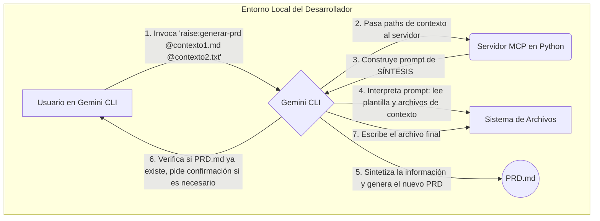

# Diseño Técnico: Raise-Gemini MCP Server

**Funcionalidad/Historia de Usuario Relacionada:** [PRD-RGMS-001](PRD-RGMS-001.md)
**Documentos Relacionados:** [PRD-RGMS-001](PRD-RGMS-001.md), [Documentación Python Gemini CLI y MCP_.md](../../Documentación%20Python%20Gemini%20CLI%20y%20MCP_.md)

## 1. Visión General y Objetivo

El objetivo técnico es desarrollar un servidor de Protocolo de Contexto de Modelo (MCP) utilizando Python. Este servidor actuará como un backend de herramientas para la Gemini CLI, exponiendo comandos personalizados que automatizan la creación de artefactos de documentación según la metodología RaiSE. El problema a resolver es la carga operativa y la complejidad asociadas con la creación manual de estos documentos, encapsulando los flujos de trabajo en comandos simples y directos.

## 2. Solución Propuesta

La solución se centrará en la creación de un servidor Python ligero basado en el framework **FastMCP**. La función principal del servidor será exponer herramientas (ej. `raise:generar-prd`) que construyen y envían **prompts de síntesis de alto nivel** a Gemini CLI.

Estos prompts instruirán al agente de la CLI para que actúe como un analista de negocio: leerá una plantilla de documento (ej. un PRD), leerá una serie de **archivos de contexto** proporcionados por el usuario (ej. transcripciones de reuniones, documentación de APIs, historias de usuario), y luego **sintetizará la información de las fuentes de contexto para rellenar de forma inteligente y coherente las secciones de la plantilla**.

El prompt también incluirá lógica de interacción para manejar casos como la duplicación de archivos de salida, pidiendo confirmación al usuario antes de realizar acciones destructivas.

## 3. Arquitectura y Desglose de Componentes

La arquitectura sigue un modelo cliente-servidor, con Gemini CLI como cliente y el servidor Python como un generador de prompts de tareas complejas.

*   **Componentes Nuevos:**
    *   `Raise-Gemini MCP Server (mcp_server.py)`: Aplicación Python con FastMCP que define las herramientas de generación de documentos.
    *   `Herramientas MCP (ej. raise:generar_prd)`: Funciones Python que aceptan una lista opcional de rutas de contexto y generan el prompt de síntesis.
    *   `Prompts de Síntesis (ej. generar_prd_prompt.txt)`: Plantillas de prompt que definen la tarea de síntesis para el LLM, incluyendo las instrucciones para leer múltiples fuentes y rellenar el documento final.

*   **Componentes Modificados:**
    *   `Gemini CLI (settings.json)`: Configurado para conectar con el servidor MCP local.



## 4. Flujo de Datos

1.  El usuario invoca la herramienta, opcionalmente proporcionando una lista de rutas a archivos de contexto: `> usa RaiseGeminiMCP para generar un prd con el contexto de @./docs/meeting.txt y @./api/spec.md`.
2.  El servidor MCP recibe la llamada con la lista de rutas de contexto.
3.  El servidor genera un nombre de archivo de salida único para el PRD (ej. `PRD-MiProyecto-20250729.md`).
4.  El servidor construye un **prompt de síntesis**. Este prompt instruye a Gemini CLI a:
    a.  Leer el contenido de la plantilla PRD (`.raise/templates/planning/prd_template.md`).
    b.  Leer el contenido de CADA uno de los archivos de contexto proporcionados.
    c.  Analizar y sintetizar la información de los archivos de contexto para rellenar las secciones correspondientes de la plantilla PRD (Resumen, Metas, Requisitos, etc.).
    d.  Verificar si el archivo de salida ya existe y pedir confirmación al usuario si es necesario antes de escribir.
5.  Gemini CLI ejecuta el prompt, realizando las lecturas, la síntesis y finalmente escribiendo el documento PRD completo y poblado en el sistema de archivos.

## 5. Contrato(s) de API

*   **Herramienta:** `raise:generar_prd`
    *   **Descripción:** Genera un nuevo Documento de Requisitos del Proyecto (PRD) sintetizando información de archivos de contexto proporcionados sobre una plantilla estándar.
    *   **Parámetros de Entrada:**
        *   `rutas_contexto: list[str] (Opcional)`: Una lista de rutas a archivos locales que servirán como fuente de conocimiento para rellenar el PRD.
    *   **Respuesta (Ejemplo de Prompt de Síntesis para Gemini CLI):**
        ```
        Tu tarea es actuar como un analista de negocio y generar un Documento de Requisitos de Proyecto (PRD).
        Realiza los siguientes pasos en orden:
        1. Define la ruta de la plantilla como 'C:\...\.raise\templates\planning\prd_template.md'.
        2. Define la ruta de salida como 'C:\...\.raise\docs\planning\PRD-MiProyecto-20250729.md'.
        3. Lee el contenido de la plantilla para entender su estructura.
        4. Lee el contenido de los siguientes archivos de contexto para obtener toda la información necesaria:
           - 'C:\...\docs\meeting.txt'
           - 'C:\...\api\spec.md'
        5. Sintetiza la información de los archivos de contexto y úsala para rellenar de forma completa y coherente cada una de las secciones de la plantilla PRD.
        6. Antes de escribir, verifica si la ruta de salida ya existe. Si es así, pide confirmación al usuario para sobrescribir.
        7. Escribe el PRD final, completo y poblado, en la ruta de salida.
        ```

## 6. Cambios en el Modelo de Datos

No hay cambios en el modelo de datos. La herramienta sigue operando sobre el sistema de archivos.

## 7. Algoritmos / Lógica Clave

La lógica clave en el servidor es la **construcción de prompts de síntesis**.

1.  Recibir la llamada con la lista opcional de `rutas_contexto`.
2.  Generar un nombre de archivo de salida único.
3.  Seleccionar la plantilla del prompt de texto.
4.  Construir las rutas absolutas para la plantilla PRD, el archivo de salida y **cada uno de los archivos de contexto**.
5.  Inyectar dinámicamente la lista de rutas de contexto en la plantilla del prompt, junto con las instrucciones de síntesis.
6.  Devolver la cadena de texto del prompt final.

## 8. Consideraciones de Seguridad

*   **Aislamiento:** El servidor sigue siendo local.
*   **Interacción del Usuario:** La confirmación de sobrescritura se mantiene como una característica de seguridad clave.
*   **Acceso a Archivos:** El usuario debe ser consciente de que está otorgando a la herramienta permiso para leer los archivos de contexto que especifique.

## 9. Estrategia de Manejo de Errores

La estrategia se expande para incluir:

*   **Nivel del LLM (Guiado por Prompt):** El prompt instruirá al agente para que maneje el caso en que uno o más de los archivos de contexto no se encuentren, informando al usuario y preguntando si desea continuar con el contexto parcial o cancelar la operación.


## 10. Alternativas Consideradas

*   **Alternativa 1:** Implementar el protocolo MCP manualmente sin un framework.
    *   **Razón de Rechazo:** Excesivamente complejo y propenso a errores. FastMCP abstrae toda la complejidad del protocolo, permitiendo centrarse en la lógica de la herramienta.
*   **Alternativa 2:** Usar un framework web genérico como Flask o AIOHTTP para el endpoint SSE.
    *   **Razón de Rechazo:** Aunque es factible, FastMCP está específicamente diseñado para el caso de uso de MCP, infiriendo esquemas de herramientas a partir de type hints y docstrings, lo que reduce significativamente el código repetitivo y la configuración.

## 11. Preguntas Abiertas y Riesgos

*   **Pregunta:** ¿Cuál es la especificación exacta (puerto, formato de mensaje) que espera el `mcp_server.json` de Gemini CLI? (Resuelto en la documentación: se usa `url` para SSE).
*   **Riesgo 1 (Técnico):** Una futura actualización de Gemini CLI podría introducir cambios que rompan la integración con el servidor MCP.
    *   **Mitigación:** Documentar la versión específica de Gemini CLI con la que el servidor es compatible y establecer un conjunto de pruebas de integración para validar la compatibilidad con nuevas versiones.
*   **Riesgo 2 (Técnico):** La librería FastMCP podría tener bugs o limitaciones no descubiertas.
    *   **Mitigación:** Realizar una prueba de concepto inicial con la librería para validar su comportamiento en los escenarios clave del proyecto.

## 13. Consideraciones para Estimación

*   **Factores de Complejidad Clave:**
    *   La curva de aprendizaje inicial para entender la interacción entre Gemini CLI y el servidor MCP.
    *   Asegurar que la construcción de prompts dinámicos sea robusta y maneje correctamente los escapes y las rutas de archivo.
*   **Incertidumbres Conocidas:**
    *   Posibles diferencias de comportamiento de Gemini CLI entre sistemas operativos (ej. Windows vs. macOS/Linux), especialmente en el manejo de rutas de archivo.
*   **Posibles Optimizaciones/Simplificaciones:**
    *   Comenzar con una única herramienta (`raise:generar-prd`) para validar el flujo completo antes de añadir más.
    *   Mantener los prompts iniciales lo más simples posible, añadiendo complejidad gradualmente.
*   **Dependencias Críticas:**
    *   Disponibilidad de una versión estable y documentada de Gemini CLI.

## 14. Estrategia de Pruebas

*   **Pruebas Unitarias:** Se crearán pruebas unitarias para cada función de herramienta en el servidor MCP. Estas pruebas verificarán que, dados ciertos parámetros de entrada, la función genera el prompt de salida esperado y correcto.
*   **Pruebas de Integración:** Se definirá un protocolo de prueba manual (y potencialmente automatizado en el futuro) que consistirá en:
    1.  Iniciar el servidor `mcp_server.py`.
    2.  Iniciar Gemini CLI con la configuración `settings.json` apuntando al servidor local.
    3.  Ejecutar el comando `/mcp` para verificar que la conexión es "Ready".
    4.  Invocar cada una de las herramientas expuestas con parámetros de prueba.
    5.  Verificar que los archivos de documentación se creen en las rutas correctas y con el contenido esperado.