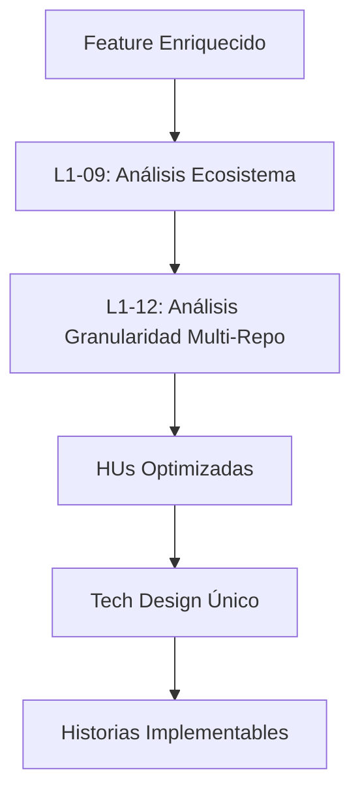

# L1-12: Análisis de Granularidad de Historias de Usuario Multi-Repositorio

## Propósito y Filosofía RaiSE

Esta kata define el proceso para analizar y optimizar la granularidad de las Historias de Usuario **DESPUÉS** del análisis de ecosistema (L1-09), incorporando el contexto de repositorios impactados y dependencias inter-repo. Sigue el principio RaiSE de **"Analizar ecosistema antes de dividir"** para tomar decisiones informadas sobre la granularidad óptima.

**🚨 PRINCIPIO CRÍTICO: PRESERVACIÓN DE CRITERIOS ORIGINALES**
- **NUNCA inventar** nuevos criterios de aceptación
- **SIEMPRE redistribuir** los criterios existentes entre sub-HUs
- **MANTENER trazabilidad** de qué criterio original corresponde a cada sub-HU
- **VALIDAR completitud** - todos los criterios originales deben estar presentes

**📝 PRINCIPIO CRÍTICO: NO SOBRESCRIBIR HUs ORIGINALES**
- **NUNCA eliminar** la HU original del archivo YAML
- **MANTENER la HU original** visible con toda su información
- **AGREGAR comentario al inicio** indicando que fue dividida y referenciando las sub-HUs
- **COLOCAR las sub-HUs debajo** de la HU original para clara trazabilidad

## Posición en el Flujo RaiSE



**Entrada:** Análisis de ecosistema completo con mapeo de servicios y dependencias
**Salida:** HUs optimizadas considerando fronteras de repositorio y coordinación inter-repo

## Cuándo Aplicar Esta Kata

- **DESPUÉS** del análisis de ecosistema L1-09
- **ANTES** del diseño técnico L1-08
- **CON CONTEXTO** de repositorios impactados y nivel de reutilización identificado

## Criterios de Evaluación Multi-Repo

### 🔴 **Indicadores de División Necesaria:**

#### 1. **Story Points + Contexto de Repositorio**

```yaml
evaluacion_con_contexto:
  hu_id: "HU-022"
  story_points: 8
  repositorios_impactados:
    - "raise-jf-backend-product": "MAJOR (95% funcionalidad)"
    - "raise-jf-backend-profile": "MINIMAL (verificación contrato)"
  
  decision: "DIVIDIR - SP alto + oportunidad de independencia por repo"
```

#### 2. **Separación Clara por Fronteras de Servicio**

```yaml
fronteras_servicio:
  hu_original: "HU-022: Visualizar productos con datos membresía"
  
  separacion_natural:
    funcionalidad_core:
      descripcion: "Visualización básica de productos"
      repositorio: "raise-jf-backend-product"
      dependencias_externas: []
    
    funcionalidad_integracion:
      descripcion: "Filtrado por membresía"
      repositorio: "raise-jf-backend-product"
      dependencias_externas: ["profile.GetMembershipAccess"]
```

#### 3. **Minimizar Coordinación Inter-Repo**

- HUs que requieren cambios sincronizados en múltiples repos → candidatas para división
- Priorizar HUs ejecutables en un solo repositorio
- Separar funcionalidad core de integraciones

### ✅ **Indicadores de Mantener Unificada:**

#### 1. **Cohesión Funcional Crítica**

```yaml
cohesion_critica:
  hu_id: "HU-023"
  descripcion: "Sistema de calificación de productos"
  justificacion_unificada:
    - "Flujo de calificación debe ser atómico"
    - "Lógica condicional (5 estrellas vs ≤4) es cohesiva"
    - "Separar rompería experiencia de usuario"
  repositorio_unico: "raise-jf-backend-product"
  coordinacion_externa: "Mínima"
```

#### 2. **Reutilización Alta del Ecosistema**

- Si L1-09 identificó 95%+ reutilización → menor necesidad de división
- Cambios mínimos en servicios existentes → mantener cohesión

## Proceso de Análisis Multi-Repo

### Paso 1: Contexto del Ecosistema por HU

```yaml
contexto_ecosistema_hu:
  feature: "F01-Producto"
  analisis_l1_09_input:
    servicios_impactados: "2 de 13"
    reutilizacion_general: "95%"
    nueva_funcionalidad: "5%"
  
  mapeo_por_hu:
    HU-022:
      repositorio_principal: "raise-jf-backend-product"
      nivel_cambios: "EXTENSION (ProductComment, ProductRating.IsClientOpinion)"
      dependencias_externas:
        - repo: "raise-jf-backend-profile"
          tipo: "CONTRACT_VERIFICATION"
          impacto: "MINIMAL"
    
    HU-023:
      repositorio_principal: "raise-jf-backend-product"
      nivel_cambios: "EXTENSION (IsClientOpinion field)"
      dependencias_externas: []
    
    HU-041:
      repositorio_principal: "raise-jf-backend-product"
      nivel_cambios: "NEW (ProductComment entity)"
      dependencias_externas: []
```

### Paso 2: Análisis de Granularidad Informado

```yaml
analisis_granularidad_informado:
  hu_evaluada: "HU-022"
  
  factores_ecosistema:
    reutilizacion_alta: true  # 95% del L1-09
    cambios_minimos: true     # Solo extensiones
    repos_multiples: false    # Principalmente 1 repo
  
  factores_granularidad:
    story_points_alto: true   # 8 SP
    responsabilidades_multiples: true
    complejidades_heterogeneas: true
  
  decision_informada:
    accion: "DIVIDIR"
    justificacion:
      - "SP alto (8) con oportunidad de paralelización"
      - "Ecosistema permite división sin afectar coordinación"
      - "Funcionalidades independientes identificadas"
      - "Reutilización alta reduce riesgo de división"
```

### Paso 3: **PRESERVACIÓN Y REDISTRIBUCIÓN DE CRITERIOS ORIGINALES**

**🚨 PASO CRÍTICO - NO INVENTAR CRITERIOS**

```yaml
preservacion_criterios_originales:
  hu_original: "HU-022"
  criterios_originales_completos:
    - id: "AC-022-01"
      texto: "El sistema debe mostrar imagen, nombre y precio del producto"
      categoria: "VISUALIZACION_BASICA"
    - id: "AC-022-02"  
      texto: "Debe permitir filtrar por catálogo disponible"
      categoria: "FILTRADO"
    - id: "AC-022-03"
      texto: "Mostrar indicadores visuales (Oferta, Gran Regalo, etc.)"
      categoria: "INDICADORES"
    - id: "AC-022-04"
      texto: "Filtrar productos según membresía del usuario"
      categoria: "MEMBRESIA"
    - id: "AC-022-05"
      texto: "Mostrar mensaje de error si no hay productos"
      categoria: "MANEJO_ERRORES"
  
  redistribucion_sin_inventar:
    HU-022A:
      titulo: "Visualizar detalle básico de producto"
      criterios_asignados:
        - "AC-022-01"  # Imagen, nombre, precio
        - "AC-022-05"  # Mensaje de error
      justificacion: "Criterios de visualización básica y manejo de errores"
    
    HU-022B:
      titulo: "Gestionar filtrado por catálogo"
      criterios_asignados:
        - "AC-022-02"  # Filtrar por catálogo
      justificacion: "Criterio específico de filtrado por catálogo"
    
    HU-022C:
      titulo: "Mostrar indicadores visuales + filtrado membresía"
      criterios_asignados:
        - "AC-022-03"  # Indicadores visuales
        - "AC-022-04"  # Filtrado por membresía
      justificacion: "Criterios de funcionalidad avanzada e integración"
  
  validacion_completitud:
    criterios_originales: 5
    criterios_redistribuidos: 5
    criterios_perdidos: 0
    criterios_inventados: 0
    estado: "COMPLETA_Y_PRESERVADA"
```

### **REGLAS ESTRICTAS PARA CRITERIOS DE ACEPTACIÓN:**

1. **🚫 PROHIBIDO:** Eliminar o sobrescribir la HU original
2. **🚫 PROHIBIDO:** Crear nuevos criterios de aceptación
3. **✅ OBLIGATORIO:** Mantener la HU original visible con comentario de división al inicio
4. **✅ OBLIGATORIO:** Redistribuir TODOS los criterios originales
5. **✅ OBLIGATORIO:** Mantener texto exacto de criterios originales
6. **✅ OBLIGATORIO:** Validar que suma de criterios = total original
7. **✅ OBLIGATORIO:** Documentar trazabilidad criterio → sub-HU

### Paso 4: Propuesta de División Optimizada CON CRITERIOS PRESERVADOS

```yaml
division_optimizada_con_criterios_preservados:
  hu_original: "HU-022"
  contexto_ecosistema: "95% reutilización, 1 repo principal"
  
  division_propuesta:
    HU-022A:
      titulo: "Visualizar detalle básico de producto"
      story_points: 3
      repositorio: "raise-jf-backend-product"
      criterios_originales_preservados:
        - "AC-022-01: El sistema debe mostrar imagen, nombre y precio del producto"
        - "AC-022-05: Mostrar mensaje de error si no hay productos"
      criterios_inventados: []  # DEBE ESTAR VACÍO
      desarrollo_independiente: true
    
    HU-022B:
      titulo: "Gestionar filtrado por catálogo"
      story_points: 2
      repositorio: "raise-jf-backend-product"
      criterios_originales_preservados:
        - "AC-022-02: Debe permitir filtrar por catálogo disponible"
      criterios_inventados: []  # DEBE ESTAR VACÍO
      desarrollo_independiente: true
    
    HU-022C:
      titulo: "Mostrar indicadores visuales + filtrado membresía"
      story_points: 3
      repositorio: "raise-jf-backend-product"
      criterios_originales_preservados:
        - "AC-022-03: Mostrar indicadores visuales (Oferta, Gran Regalo, etc.)"
        - "AC-022-04: Filtrar productos según membresía del usuario"
      criterios_inventados: []  # DEBE ESTAR VACÍO
      dependencias_externas:
        - repo: "raise-jf-backend-profile"
          accion: "Verificar exposición MembershipAccess"
          tipo: "CONTRACT_VERIFICATION"
          bloquea_desarrollo: false
      desarrollo_independiente: true
    
  validacion_preservacion:
    total_criterios_originales: 5
    total_criterios_redistribuidos: 5
    criterios_perdidos: 0
    criterios_inventados: 0
    preservacion_completa: true
```

### Paso 5: Validación Multi-Repo CON PRESERVACIÓN

```yaml
validacion_multirepo_con_preservacion:
  criterios_ecosistema:
    preserva_reutilizacion: true  # Mantiene 95% del L1-09
    minimiza_coordinacion: true   # Solo verificaciones
    respeta_fronteras_servicio: true
  
  criterios_granularidad:
    story_points_balanceados: true  # 3+2+3 vs 8 original
    desarrollo_paralelo: true       # 3 sub-HUs independientes
    valor_incremental: true         # Cada sub-HU entrega valor
  
  criterios_preservacion:  # ⭐ NUEVA VALIDACIÓN CRÍTICA
    criterios_originales_preservados: true
    texto_exacto_mantenido: true
    trazabilidad_completa: true
    criterios_inventados: false  # DEBE SER FALSE
    completitud_validada: true
  
  criterios_implementacion:
    tech_design_simplificado: true  # División antes del diseño
    estimaciones_precisas: true     # HUs más pequeñas
    riesgo_reducido: true           # De 8 SP a máximo 3 SP
```

## Patrones de División Multi-Repo CON PRESERVACIÓN DE CRITERIOS

### Patrón 1: División por Agrupación Natural de Criterios

```yaml
patron_agrupacion_natural:
  descripcion: "Agrupar criterios por contexto funcional natural"
  
  ejemplo_aplicacion:
    hu_original: "HU-057: Informar excedentes y autorizar"
    criterios_originales:
      - "AC-057-01: Mostrar alerta cuando pedido excede límite"
      - "AC-057-02: Mostrar monto del excedente"
      - "AC-057-03: Mostrar límite de crédito actual"
      - "AC-057-04: Mostrar monto total del pedido"
      - "AC-057-05: Permitir autorizar hasta 50% adicional"
      - "AC-057-06: Mostrar consecuencias de autorización"
      - "AC-057-07: Validar permisos de líder"
    
    agrupacion_natural:
      grupo_deteccion:
        criterios: ["AC-057-01", "AC-057-02", "AC-057-03", "AC-057-04"]
        justificacion: "Todos relacionados con mostrar información del excedente"
        sub_hu: "HU-057A: Detectar y mostrar excedentes"
      
      grupo_autorizacion:
        criterios: ["AC-057-05", "AC-057-06"]
        justificacion: "Ambos sobre el proceso de autorización"
        sub_hu: "HU-057B: Autorizar excedentes con límite"
      
      grupo_permisos:
        criterios: ["AC-057-07"]
        justificacion: "Validación de permisos es contexto separado"
        sub_hu: "HU-057C: Validar permisos de autorización"
  
  validacion:
    criterios_originales: 7
    criterios_redistribuidos: 7
    criterios_perdidos: 0
    criterios_inventados: 0
```

### Patrón 2: División por Flujo Secuencial SIN Inventar Criterios

```yaml
patron_flujo_secuencial:
  descripcion: "Dividir por pasos del flujo preservando criterios exactos"
  
  ejemplo_aplicacion:
    hu_original: "HU-013: Detectar y notificar reactivación"
    criterios_originales:
      - "AC-013-01: Detectar automáticamente reactivación al aprobar"
      - "AC-013-02: Mostrar notificación de reactivación al líder"
      - "AC-013-03: Permitir al líder confirmar o cancelar reactivación"
      - "AC-013-04: Enviar notificación al consultor reactivado"
      - "AC-013-05: Registrar evento de reactivación en historial"
    
    division_por_flujo:
      paso_deteccion:
        criterios: ["AC-013-01"]
        sub_hu: "HU-013A: Detectar reactivación automática"
      
      paso_notificacion_lider:
        criterios: ["AC-013-02", "AC-013-03"]
        sub_hu: "HU-013B: Notificar y gestionar confirmación de líder"
      
      paso_completar_reactivacion:
        criterios: ["AC-013-04", "AC-013-05"]
        sub_hu: "HU-013C: Completar proceso de reactivación"
  
  validacion:
    preserva_flujo_original: true
    criterios_originales: 5
    criterios_redistribuidos: 5
    criterios_perdidos: 0
    criterios_inventados: 0
```

### Patrón 3: Mantener Cohesión Crítica SIN División

```yaml
patron_cohesion_critica:
  descripcion: "No dividir cuando rompe flujo de usuario O cuando criterios son indivisibles"
  
  aplicacion:
    hu_cohesiva: "HU-023: Sistema calificación completo"
    criterios_originales:
      - "AC-023-01: Permitir calificar con 1-5 estrellas"
      - "AC-023-02: Si calificación ≤4, solicitar comentario obligatorio"
      - "AC-023-03: Si calificación = 5, comentario opcional"
      - "AC-023-04: Validar que solo clientes pueden calificar"
    
    analisis_indivisibilidad:
      - "AC-023-02 y AC-023-03 forman lógica condicional cohesiva"
      - "Separar rompería experiencia de usuario"
      - "Criterios están fuertemente acoplados"
    
    decision: "MANTENER_UNIFICADA"
    justificacion: "Criterios forman flujo atómico indivisible"
```

## **CHECKLIST DE PRESERVACIÓN DE CRITERIOS**

### ✅ **Antes de Dividir:**
- [ ] Identificar TODOS los criterios de aceptación originales
- [ ] Numerar y categorizar cada criterio
- [ ] Verificar que no hay criterios implícitos que se puedan perder

### ✅ **Durante la División:**
- [ ] **MANTENER la HU original** visible con toda su información
- [ ] **AGREGAR comentario al inicio** de la HU original indicando división
- [ ] **COLOCAR las sub-HUs debajo** de la HU original
- [ ] Asignar cada criterio original a exactamente una sub-HU
- [ ] NO modificar el texto de criterios originales
- [ ] NO agregar criterios nuevos o "mejorados"
- [ ] Documentar la asignación criterio → sub-HU

### ✅ **Después de Dividir:**
- [ ] Validar que suma de criterios = total original
- [ ] Verificar que no se perdió ningún criterio
- [ ] Confirmar que no se inventó ningún criterio
- [ ] Documentar trazabilidad completa

### 🚫 **ERRORES COMUNES A EVITAR:**
- **ELIMINAR la HU original** del archivo YAML
- **COMENTAR completamente** la HU original (debe mantenerse visible)
- **SOBRESCRIBIR información** de la HU original sin preservarla
- Agregar criterios "técnicos" no mencionados en original
- "Mejorar" criterios existentes con más detalle
- Crear criterios de "validación" o "error handling" no originales
- Dividir criterios atómicos en sub-criterios
- Asumir criterios implícitos que "deberían estar"

## Documentación de Salida CON PRESERVACIÓN

### 1. Análisis de Granularidad Multi-Repo

```yaml
documento_analisis:
  feature: "F01-Producto"
  contexto_ecosistema:
    reutilizacion: "95%"
    servicios_impactados: "2 de 13"
    coordinacion_requerida: "Mínima"
  
  evaluacion_por_hu:
    HU-022:
      decision: "DIVIDIR en 3 sub-HUs"
      justificacion: "SP alto + oportunidades de paralelización"
      impacto_ecosistema: "Ninguno - preserva reutilización"
      preservacion_criterios:
        criterios_originales: 5
        criterios_redistribuidos: 5
        criterios_perdidos: 0
        criterios_inventados: 0
    
    HU-023:
      decision: "MANTENER unificada"
      justificacion: "Cohesión funcional crítica + criterios indivisibles"
      impacto_ecosistema: "Ninguno"
      preservacion_criterios:
        criterios_originales: 4
        criterios_mantenidos: 4
        razon_no_division: "Criterios forman flujo atómico"
    
    # ... resto de HUs
```

### 2. HUs Optimizadas CON CRITERIOS PRESERVADOS

```yaml
hus_optimizadas:
  total_original: 5
  total_optimizado: 7
  
  distribucion_story_points:
    antes: [8, 5, 3, 2, 3]  # Total: 21 SP
    despues: [3, 2, 3, 5, 3, 2, 3]  # Total: 21 SP
  
  preservacion_criterios:
    total_criterios_originales: 18
    total_criterios_redistribuidos: 18
    criterios_perdidos: 0
    criterios_inventados: 0
    preservacion_completa: true
  
  mejoras_logradas:
    hu_mayor_6sp: "0% (antes: 20%)"
    desarrollo_paralelo: "85% HUs independientes"
    coordinacion_inter_repo: "14% (1 de 7 HUs)"
    preservacion_informacion: "100%"
```

### **Estructura de las Nuevas Secciones en el YAML CON PRESERVACIÓN:**

```yaml
# Secciones agregadas al F0X-NombreFeature-enriched.yaml existente

granularity_analysis:
  execution_date: "2024-12-XX"
  kata_applied: "L1-12"
  preservation_validation:  # ⭐ NUEVA SECCIÓN CRÍTICA
    total_original_criteria: 18
    total_redistributed_criteria: 18
    criteria_lost: 0
    criteria_invented: 0
    preservation_complete: true
  
  ecosystem_context:
    reuse_level: "95%"
    impacted_services: "2 de 13"
    coordination_required: "Minimal"
  
  decisions_summary:
    original_hus: 5
    optimized_hus: 7
    divisions_made: 1  # HU-022 dividida en 3
    maintained_unified: 4
  
  parallelization_metrics:
    independent_development: "85%"  # 6 de 7 HUs
    inter_repo_coordination: "14%"  # 1 de 7 HUs
    max_story_points: 5  # Antes era 8

# Las HUs divididas DEBEN incluir trazabilidad de criterios
user_stories:
  # 🚨 INSTRUCCIÓN CRÍTICA: PRESERVAR HU ORIGINAL VISIBLE
  # ====================================================
  # NUNCA eliminar la HU original. MANTENERLA visible con comentario al inicio.
  # Colocar las sub-HUs debajo para clara trazabilidad.
  
  # HU original mantenida visible con comentario de división
  - id: "HU-022"
    # NOTA: Esta HU ha sido dividida en 3 sub-HUs para optimizar granularidad
    # Estado: DIVIDIDA - Ver sub-HUs HU-022A, HU-022B, HU-022C debajo
    title: "Visualizar productos del catálogo"
    story_points: 8
    granularity_decision: "DIVIDED_INTO_3_SUBHUS"
    acceptance_criteria:
      - "AC-022-01: El sistema debe mostrar imagen, nombre y precio del producto"
      - "AC-022-02: Debe permitir filtrar por catálogo disponible"
      - "AC-022-03: Mostrar indicadores visuales (Oferta, Gran Regalo, etc.)"
      - "AC-022-04: Filtrar productos según membresía del usuario"
      - "AC-022-05: Mostrar mensaje de error si no hay productos"
  
  # SUB-HUs derivadas de HU-022 (colocadas debajo de la HU original)
  - id: "HU-022A"
    title: "Visualizar detalle básico de producto"
    story_points: 3
    parent_story: "HU-022"
    granularity_decision: "DIVIDED_FROM_HU-022"
    acceptance_criteria:  # SOLO CRITERIOS ORIGINALES
      - "AC-022-01: El sistema debe mostrar imagen, nombre y precio del producto"
      - "AC-022-05: Mostrar mensaje de error si no hay productos"
    criteria_traceability:
      original_criteria_count: 2
      invented_criteria_count: 0
      source_hu: "HU-022"
    # ... resto de la HU
  
  - id: "HU-022B"
    title: "Gestionar filtrado por catálogo"
    story_points: 2
    parent_story: "HU-022"
    granularity_decision: "DIVIDED_FROM_HU-022"
    acceptance_criteria:  # SOLO CRITERIOS ORIGINALES
      - "AC-022-02: Debe permitir filtrar por catálogo disponible"
    criteria_traceability:
      original_criteria_count: 1
      invented_criteria_count: 0
      source_hu: "HU-022"
    # ... resto de la HU
  
  - id: "HU-022C"
    title: "Mostrar indicadores visuales + filtrado membresía"
    story_points: 3
    parent_story: "HU-022"
    granularity_decision: "DIVIDED_FROM_HU-022"
    acceptance_criteria:  # SOLO CRITERIOS ORIGINALES
      - "AC-022-03: Mostrar indicadores visuales (Oferta, Gran Regalo, etc.)"
      - "AC-022-04: Filtrar productos según membresía del usuario"
    criteria_traceability:
      original_criteria_count: 2
      invented_criteria_count: 0
      source_hu: "HU-022"
    inter_repo_coordination:
      required: true
      target_repo: "raise-jf-backend-profile"
      action: "Verify MembershipAccess contract"
      blocks_development: false
    # ... resto de la HU
  
  # HUs mantenidas (NO divididas)
  - id: "HU-023"
    # ... HU existente SIN CAMBIOS EN CRITERIOS ...
    # NOTA: Esta HU se mantiene unificada por cohesión funcional crítica
    granularity_decision: "MAINTAINED_UNIFIED"
    justification: "Cohesión funcional crítica - criterios forman flujo atómico indivisible"
    criteria_preservation:
      original_criteria_maintained: true
      criteria_indivisible: true
```

### **Criterios de Calidad del Output CON PRESERVACIÓN:**

- ✅ **Granularidad Optimizada:** 0% HUs >6 SP
- ✅ **Desarrollo Paralelo:** >80% HUs independientes  
- ✅ **Coordinación Mínima:** <20% HUs requieren sincronización inter-repo
- ✅ **Preservación Ecosistema:** Mantiene nivel de reutilización del L1-09
- ✅ **Preservación Criterios:** 100% criterios originales preservados, 0% criterios inventados
- ✅ **Preservación Histórica:** HUs originales comentadas y preservadas para trazabilidad
- ✅ **Trazabilidad Completa:** Decisiones justificadas con contexto del ecosistema y mapeo criterio→sub-HU
- ✅ **Validación de Completitud:** Suma de criterios redistribuidos = total criterios originales

### **🚨 VALIDACIÓN FINAL OBLIGATORIA:**

Antes de completar la kata, verificar:
- [ ] **Todas las HUs divididas están visibles** (no eliminadas) en el YAML
- [ ] **Cada HU dividida tiene comentario al inicio** indicando división y referencias a sub-HUs
- [ ] **Sub-HUs colocadas debajo** de la HU original para clara trazabilidad
- [ ] **Información original 100% preservada** para auditoría y trazabilidad
- [ ] **Sub-HUs incluyen `parent_story`** referenciando la HU original
- [ ] **Criterios redistribuidos suman exactamente** los criterios originales
- [ ] **No se inventaron criterios nuevos** durante la división
