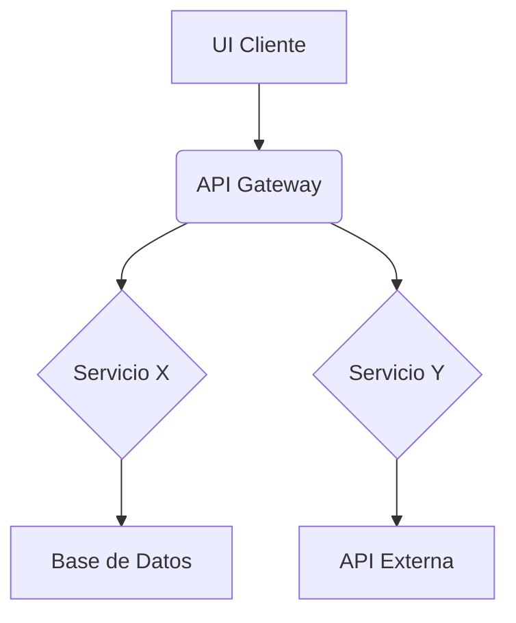

# Diseño Técnico: [Título de la Funcionalidad/Historia de Usuario]

**Funcionalidad/Historia de Usuario Relacionada:** [Enlace o ID, ej., Epic-F05, US-101]
**Documentos Relacionados:** [Lista de IDs, ej., PRD-XYZ-001, VIS-XYZ-001]

## 1. Visión General y Objetivo

*(Resuma brevemente el objetivo desde una perspectiva técnica. ¿Qué problema técnico estamos resolviendo o qué capacidad estamos construyendo?)*

## 2. Solución Propuesta

*(Proporcione un resumen de alto nivel del enfoque técnico. ¿Cómo se construirá esto? ¿Cuáles son las principales piezas involucradas?)*

## 3. Arquitectura y Desglose de Componentes

*(Detalle los componentes del sistema involucrados, tanto nuevos como existentes. Use listas, descripciones y considere diagramas si son útiles (ej., sintaxis Mermaid o enlaces a diagramas externos).)*

*   **Componentes Nuevos:**
    *   `[NombreComponente]`: [Propósito, responsabilidades, lenguaje/framework]. *Actividades SoW Asociadas (Ref: SoW Sec 3.2):* [Lista de actividades/IDs]
    *   ...
*   **Componentes Modificados:**
    *   `[NombreComponente]`: [Descripción de los cambios]. *Actividades SoW Asociadas (Ref: SoW Sec 3.2):* [Lista de actividades/IDs]
    *   ...
*   **Servicios Externos:**
    *   `[NombreServicio]`: [Cómo se usa, endpoints específicos]. *Actividades SoW Asociadas (Ref: SoW Sec 3.2):* [Lista de actividades/IDs]
    *   ...

*(Ejemplo de Diagrama Mermaid Opcional)*

## 4. Flujo de Datos

*(Describa cómo los datos se mueven a través del sistema para esta funcionalidad/historia. ¿Dónde se originan, cómo se transforman, dónde se almacenan?)*

## 5. Contrato(s) de API

*(Defina o enlace a especificaciones para cualquier API nueva o modificada.)*

*   **Endpoint:** `[MÉTODO] /ruta/al/endpoint`
    *   **Descripción:** ...
    *   **Cuerpo/Parámetros de la Solicitud:** [Detalles o enlace a Especificación de API]
    *   **Cuerpo de la Respuesta:** [Detalles o enlace a Especificación de API]
    *   *Actividades SoW Asociadas (Ref: SoW Sec 3.2):* [Lista de actividades/IDs]
*   *(Repetir para otros endpoints)*

## 6. Cambios en el Modelo de Datos

*(Especifique cambios en esquemas de base de datos, estructuras de datos, etc.)*

*   **Tabla/Colección:** `[NombreTabla]`
    *   **Campos Nuevos:** `[nombre_campo (tipo)]`
    *   **Campos Modificados:** `[nombre_campo (nuevo_tipo/restricciones)]`
    *   **Índices Nuevos:** `[nombre_indice en (campos)]`
*   **Migraciones de Datos:** [Describa cualquier paso de migración de datos requerido]

## 7. Algoritmos / Lógica Clave

*(Explique cualquier algoritmo complejo, lógica de negocio o pasos de procesamiento no obvios.)*

## 8. Consideraciones de Seguridad

*(Detalle medidas específicas de seguridad, vulnerabilidades potenciales abordadas, lógica de autenticación/autorización.)*

## 9. Estrategia de Manejo de Errores

*(Describa cómo se manejarán, registrarán y presentarán los errores (ej., errores de API, errores de validación, excepciones inesperadas) al usuario o sistema.)*

## 10. Alternativas Consideradas

*(Describa brevemente otros enfoques técnicos que fueron considerados y por qué se eligió la solución propuesta. Proporciona contexto valioso.)*

*   **Alternativa 1:** [Descripción] - **Razón de Rechazo:** [ej., Preocupaciones de rendimiento, complejidad]
*   **Alternativa 2:** [Descripción] - **Razón de Rechazo:** [ej., Problemas de escalabilidad]

## 11. Preguntas Abiertas y Riesgos

*(Liste cualquier pregunta no resuelta o riesgos potenciales asociados con este diseño.)*

*   **Pregunta:** [ej., ¿Cómo se debe manejar el caso extremo X?]
*   **Riesgo:** [ej., Dependencia de la disponibilidad del servicio externo]

## 13. Consideraciones para Estimación
*(Esta sección proporciona información relevante para el proceso de estimación, sirviendo como input para `estimation_roadmap.md`)*

*   **Factores de Complejidad Clave:** [ej., Algoritmo complejo X, Integración con sistema legado Y, Necesidad de refactorización Z]
*   **Incertidumbres Conocidas:** [ej., Rendimiento de la API externa, Falta de especificación detallada para componente W]
*   **Posibles Optimizaciones/Simplificaciones:** [ej., Usar librería X en lugar de desarrollar Y, Posponer funcionalidad Z si la complejidad es muy alta]
*   **Dependencias Críticas (que afectan esfuerzo):** [ej., Disponibilidad de entorno de pruebas, Entrega de componente B por otro equipo]
*   **Oportunidades de Reutilización:** [ej., Reutilizar módulo X existente, Adaptar componente Y de proyecto anterior]

## 14. Estrategia de Pruebas

*(Describa el enfoque para probar esta implementación. ¿Qué tipos de pruebas son necesarias (unitarias, integración, e2e)? ¿Cuáles son las áreas clave a cubrir?)* 